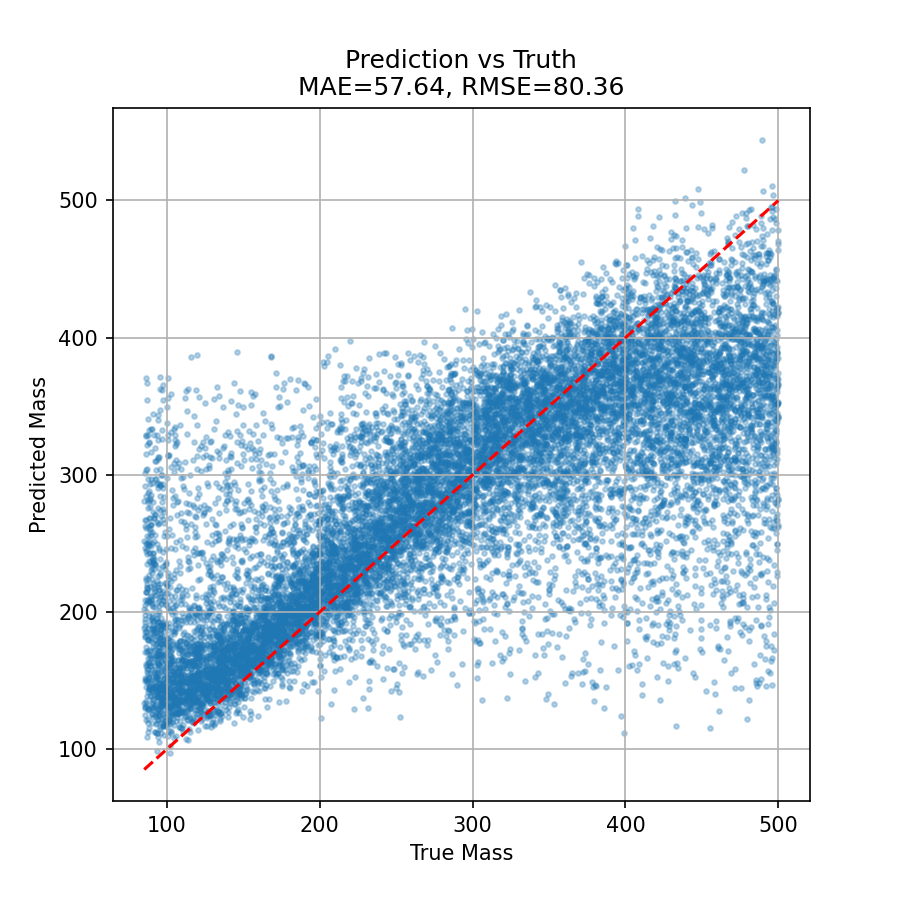
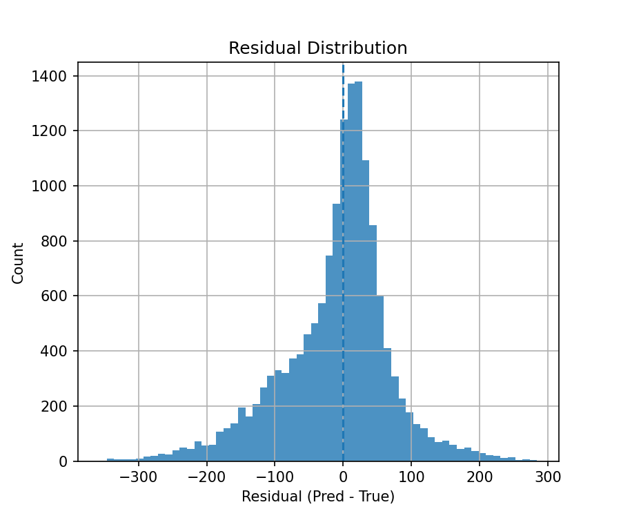
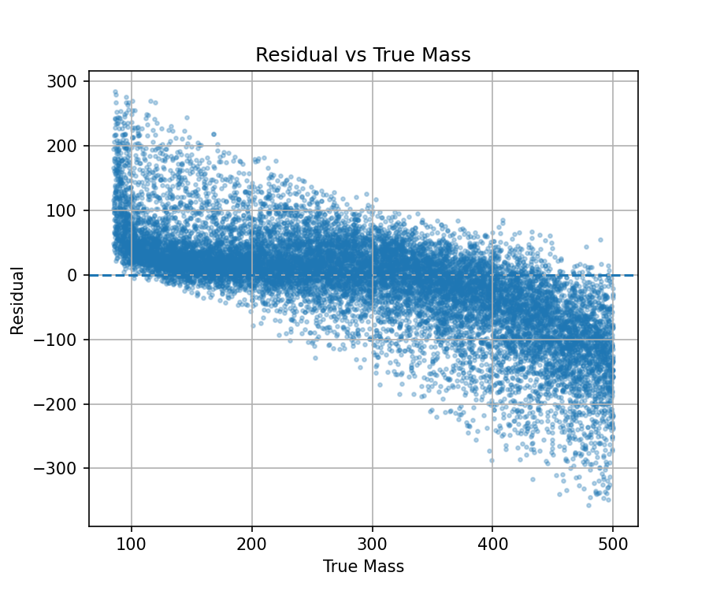
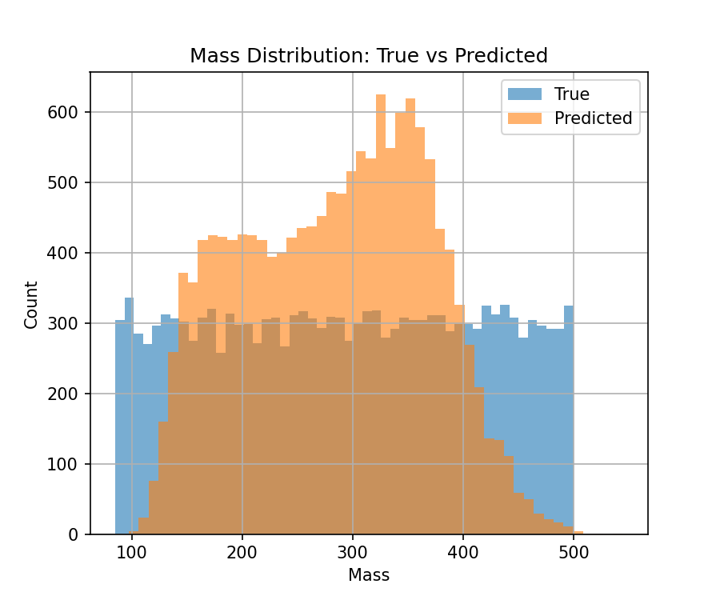
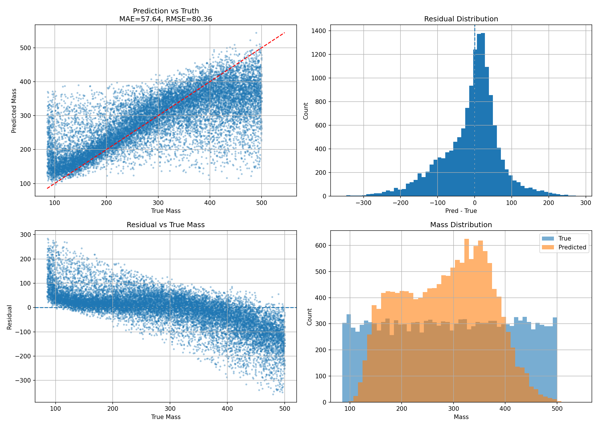

# e2e-mass-regression-cms

This project implements a complete deep learning pipeline to estimate particle mass from detector-level jet images. The workflow covers data processing, model training, evaluation, and deployment using ONNX for integration with the CMSSW inference pipeline.

---

## Overview

The goal is to predict the jet mass from high-dimensional detector data represented as multi-channel images. The pipeline is designed to be:

* End-to-end from raw parquet data to predictions
* Physically meaningful through preprocessing and evaluation
* Deployment-ready via ONNX export

---

## Dataset

The dataset consists of jet-level information with the following structure:

* `X_jet`: multi-channel detector image data
* `m`: target variable (jet mass)
* `pt`, `iphi`, `ieta`: auxiliary features

Each sample is converted into a 4-channel image of shape:

```
(4, 125, 125)
```

Only selected channels are used to match the task requirements.

---

## Preprocessing

The following transformations are applied:

* Signed log transform

  ```
  sign(x) * log1p(abs(x))
  ```

  This stabilizes extreme values while preserving sign.

* Standard normalization using training statistics only

* Auxiliary feature normalization for `pt`, `iphi`, and `ieta`

---

## Model Architecture

The model is a convolutional neural network with residual and attention components:

* Convolutional stem
* Residual blocks for stable training
* Squeeze-and-Excitation blocks for channel attention
* Global pooling
* Fusion with auxiliary features
* Fully connected regression head

The final model predicts a single scalar mass value.

---

## Training Setup

* Loss: Mean Squared Error
* Optimizer: AdamW
* Learning rate: 5e-4
* Scheduler: ReduceLROnPlateau
* Mixed precision training enabled
* Gradient clipping applied
* Early stopping based on validation loss

---

## Results

### Validation Performance

| Metric | Value |
| ------ | ----- |
| MAE    | 57.64 |
| RMSE   | 80.36 |
| R²     | 0.55  |

### Test Performance

| Metric | Value  |
| ------ | ------ |
| MAE    | 55.54  |
| RMSE   | 77.61  |
| R²     | 0.5780 |

The consistency between validation and test results indicates good generalization.

---

## Visual Diagnostics

### Prediction vs Truth



### Residual Distribution



### Residual vs True



### Distribution Comparison



### Full Dashboard



---

## Inference Pipeline

The trained model is used to generate predictions on the test set:

* Full dataset inference
* Predictions saved to CSV
* Metrics computed using denormalized outputs

Output file:

```
test_predictions.csv
```

---

## ONNX Export

The model is exported to ONNX for deployment:

* CPU export
* Opset version 11
* Dynamic batch size support
* Two-input model (image + auxiliary features)

Output file:

```
sample.onnx
```

This model is compatible with CMSSW inference workflows.

--- 
## CMSSW Inference (Task 2g)

The CMS Software Framework (CMSSW) environment was successfully set up locally using Docker, and the ONNX model was integrated into the inference workflow via the RecoE2E package.

However, executing the full CMSSW inference pipeline using `EGInference_cfg.py` requires access to external CMS infrastructure, including:

- Frontier conditions database  
- Detector geometry packages  
- Properly configured CVMFS environment  

These dependencies are not fully available in a standalone local Docker setup. As a result, complete execution of the CMSSW pipeline could not be achieved locally.

To address this limitation, the exported ONNX model was validated independently using ONNX Runtime. The model successfully performed inference with the expected input structure (image + auxiliary features), and timing measurements were obtained:
```
Average inference time: 0.124 s per event
```
---
```markdown
## Repository Structure

.
├── e2e_mass_regression_cms_pipeline.ipynb
├── task2g_inference_timing.py
├── model/
│ ├── best_model.pth
│ ├── sample.onnx
│ └── norm.pkl
├── results/
│ ├── dashboard.png
│ ├── scatter.png
│ ├── residual_hist.png
│ ├── residual_vs_true.png
│ ├── distribution.png
│ ├── metrics.txt
│ └── test_predictions.csv
└── README.md
